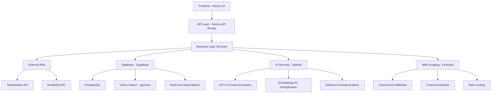
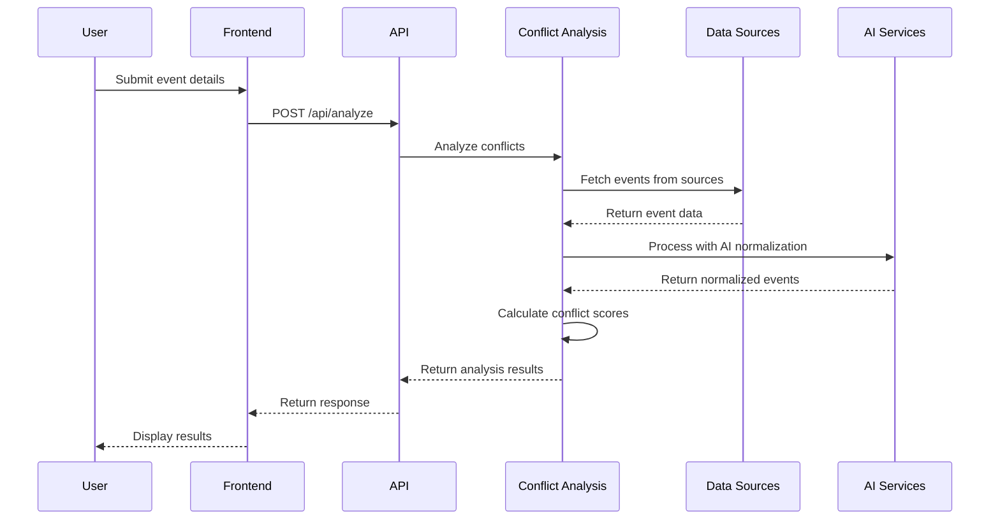
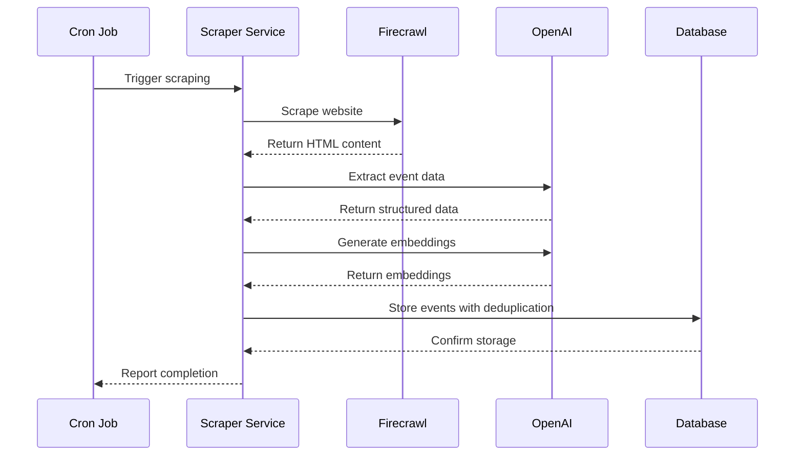

# System Architecture Overview

## High-Level Architecture

Oslavu follows a modern, scalable architecture built on Next.js with AI-powered event analysis capabilities.



## Core Components

### 1. Frontend Layer
- **Framework**: Next.js 15 with App Router
- **Language**: TypeScript for type safety
- **Styling**: Tailwind CSS with custom design system
- **Components**: shadcn/ui component library
- **State Management**: @tanstack/react-query for server state

### 2. API Layer
- **Framework**: Next.js API routes with Vercel serverless functions
- **Authentication**: Supabase Auth with Row-Level Security
- **Rate Limiting**: Built-in request throttling
- **Error Handling**: Comprehensive error responses

### 3. Business Logic Services
- **Conflict Analysis**: Core conflict detection engine
- **Event Scraper**: Web scraping and content extraction
- **AI Normalization**: Event data processing and deduplication
- **Batch Processing**: Optimized audience overlap analysis
- **Observability**: Monitoring and metrics collection

### 4. Data Layer
- **Database**: Supabase (PostgreSQL) with vector extensions
- **Vector Search**: Semantic similarity using pgvector
- **Real-time**: Supabase real-time subscriptions
- **Caching**: Intelligent request deduplication

## Data Flow

### 1. Event Analysis Workflow


### 2. Web Scraping Workflow


## Database Schema

### Core Tables

#### Events Table
```sql
CREATE TABLE events (
  id UUID PRIMARY KEY DEFAULT gen_random_uuid(),
  title VARCHAR(500) NOT NULL,
  description TEXT,
  date TIMESTAMP WITH TIME ZONE NOT NULL,
  end_date TIMESTAMP WITH TIME ZONE,
  city VARCHAR(100) NOT NULL,
  venue VARCHAR(200),
  category VARCHAR(100) NOT NULL,
  subcategory VARCHAR(100),
  expected_attendees INTEGER,
  source VARCHAR(50) NOT NULL,
  source_id VARCHAR(200),
  url TEXT,
  image_url TEXT,
  embedding VECTOR(1536), -- For semantic similarity
  normalized_city TEXT,
  normalized_category TEXT,
  confidence_score DECIMAL(3,2),
  normalization_method TEXT,
  created_at TIMESTAMP WITH TIME ZONE DEFAULT NOW(),
  updated_at TIMESTAMP WITH TIME ZONE DEFAULT NOW()
);
```

#### Conflict Analyses Table
```sql
CREATE TABLE conflict_analyses (
  id UUID PRIMARY KEY DEFAULT gen_random_uuid(),
  user_id UUID REFERENCES users(id),
  city VARCHAR(100) NOT NULL,
  category VARCHAR(100) NOT NULL,
  subcategory VARCHAR(100),
  preferred_dates JSONB NOT NULL,
  expected_attendees INTEGER NOT NULL,
  date_range_start DATE NOT NULL,
  date_range_end DATE NOT NULL,
  results JSONB NOT NULL,
  created_at TIMESTAMP WITH TIME ZONE DEFAULT NOW()
);
```

#### Web Scraping Infrastructure
```sql
CREATE TABLE scraper_sources (
  id UUID PRIMARY KEY DEFAULT gen_random_uuid(),
  name VARCHAR(100) NOT NULL,
  url TEXT NOT NULL,
  type VARCHAR(20) NOT NULL,
  enabled BOOLEAN DEFAULT true,
  config JSONB DEFAULT '{}',
  last_scraped_at TIMESTAMP WITH TIME ZONE,
  created_at TIMESTAMP WITH TIME ZONE DEFAULT NOW()
);

CREATE TABLE sync_logs (
  id UUID PRIMARY KEY DEFAULT gen_random_uuid(),
  source VARCHAR(100) NOT NULL,
  status VARCHAR(20) NOT NULL,
  events_processed INTEGER DEFAULT 0,
  events_created INTEGER DEFAULT 0,
  started_at TIMESTAMP WITH TIME ZONE DEFAULT NOW(),
  completed_at TIMESTAMP WITH TIME ZONE
);
```

## AI Integration

### 1. Content Extraction
- **Service**: OpenAI GPT-4
- **Purpose**: Extract structured event data from HTML
- **Input**: Raw HTML content from scraped websites
- **Output**: Normalized event objects

### 2. Semantic Deduplication
- **Service**: OpenAI Embeddings
- **Purpose**: Detect duplicate events across sources
- **Input**: Event titles and descriptions
- **Output**: Vector embeddings for similarity comparison

### 3. Audience Overlap Analysis
- **Service**: OpenAI GPT-4 with batch processing
- **Purpose**: Predict audience overlap between events
- **Input**: Event details and categories
- **Output**: Overlap scores and reasoning

## Performance Optimizations

### 1. Batch Processing
- **Parallel Processing**: 5 events simultaneously
- **Controlled Concurrency**: Max 2 batches running at once
- **Smart Batching**: Groups events for optimal processing

### 2. Caching Strategy
- **Request Deduplication**: Prevents duplicate API calls
- **Embedding Caching**: Reuses embeddings for similar events
- **Result Caching**: Caches analysis results

### 3. Database Optimizations
- **Vector Indexing**: Fast semantic similarity search
- **Query Optimization**: Efficient database queries
- **Connection Pooling**: Optimized database connections

## Security

### 1. Authentication & Authorization
- **Supabase Auth**: User authentication
- **Row-Level Security**: Data isolation
- **API Key Management**: Secure external API access

### 2. Data Protection
- **Input Sanitization**: All user inputs sanitized
- **SQL Injection Prevention**: Parameterized queries
- **Rate Limiting**: Prevents abuse

### 3. External API Security
- **API Key Rotation**: Regular key updates
- **Request Signing**: Secure API communications
- **Error Handling**: No sensitive data in errors

## Monitoring & Observability

### 1. Metrics Collection
- **Source Health**: Event counts per source
- **Normalization Quality**: Confidence scores
- **Performance Metrics**: Response times and throughput
- **Error Tracking**: Comprehensive error logging

### 2. Alerting
- **Low Event Counts**: < 10 events per source
- **Poor Normalization**: < 0.5 confidence score
- **Stale Data**: > 7 days since sync
- **Performance Issues**: > 10 second response times

### 3. Dashboards
- **Real-time Metrics**: Live performance monitoring
- **Historical Data**: Trend analysis
- **Source Status**: Health of data sources

## Scalability

### 1. Horizontal Scaling
- **Serverless Functions**: Auto-scaling with Vercel
- **Database Scaling**: Supabase managed scaling
- **CDN**: Global content delivery

### 2. Performance Scaling
- **Batch Processing**: Handles 100+ events efficiently
- **Caching**: Reduces repeated processing
- **Optimization**: 10x performance improvements

### 3. Data Scaling
- **Vector Search**: Efficient similarity search
- **Partitioning**: Database table partitioning
- **Archiving**: Historical data management

## Deployment

### 1. Environment Management
- **Development**: Local development with Supabase
- **Staging**: Preview deployments with Vercel
- **Production**: Production deployment with monitoring

### 2. CI/CD Pipeline
- **Automated Testing**: Type checking and linting
- **Database Migrations**: Automated schema updates
- **Deployment**: Automatic deployment on merge

### 3. Monitoring
- **Uptime Monitoring**: Service availability
- **Performance Monitoring**: Response times and errors
- **Business Metrics**: Event analysis success rates
